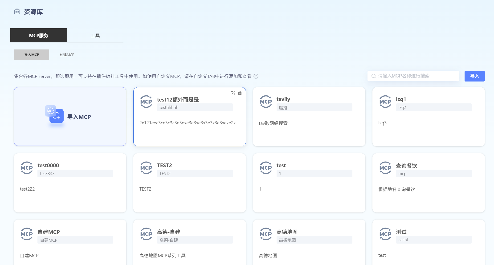
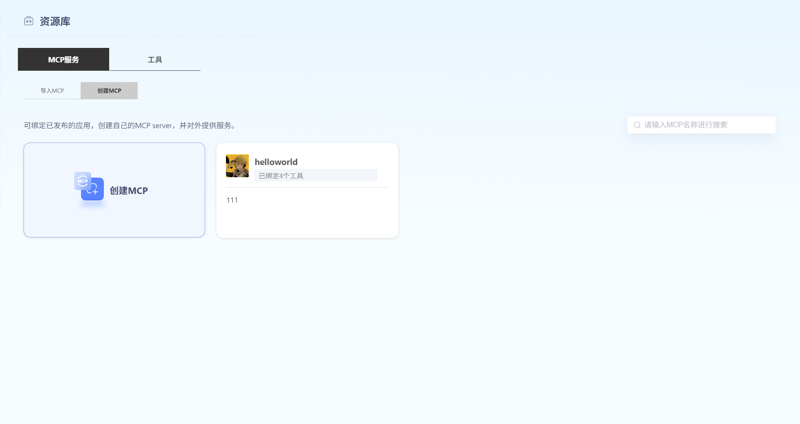
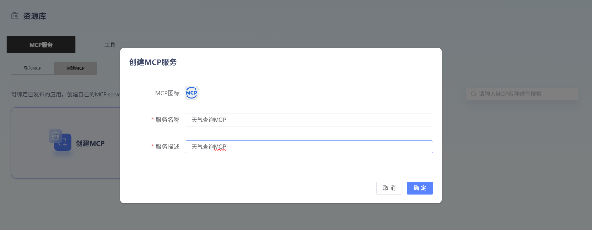
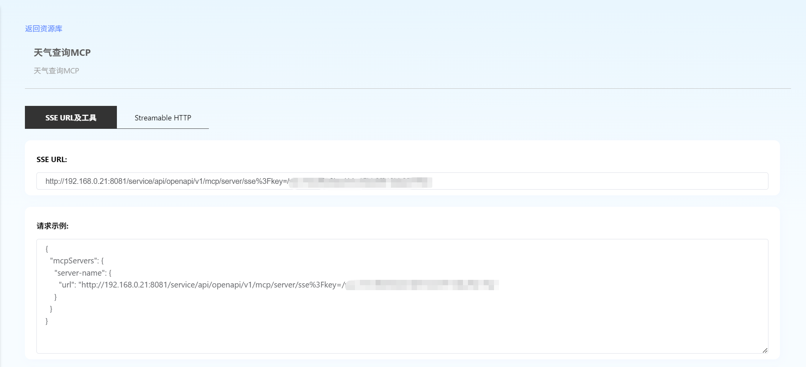
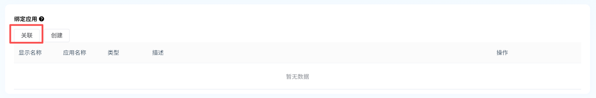
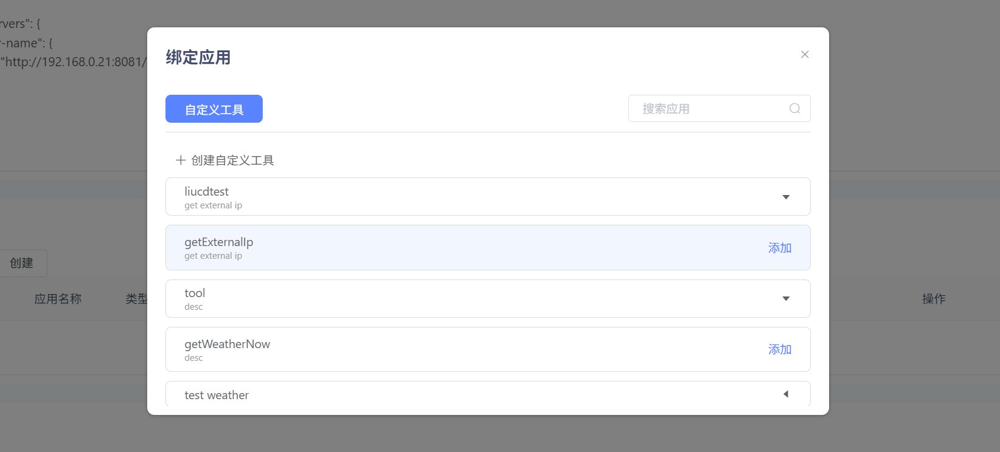
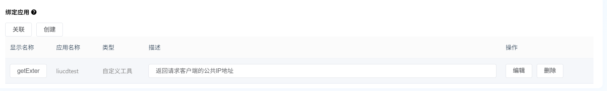
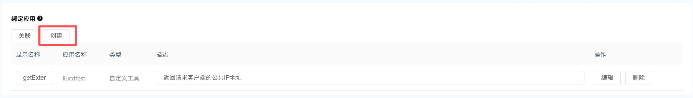
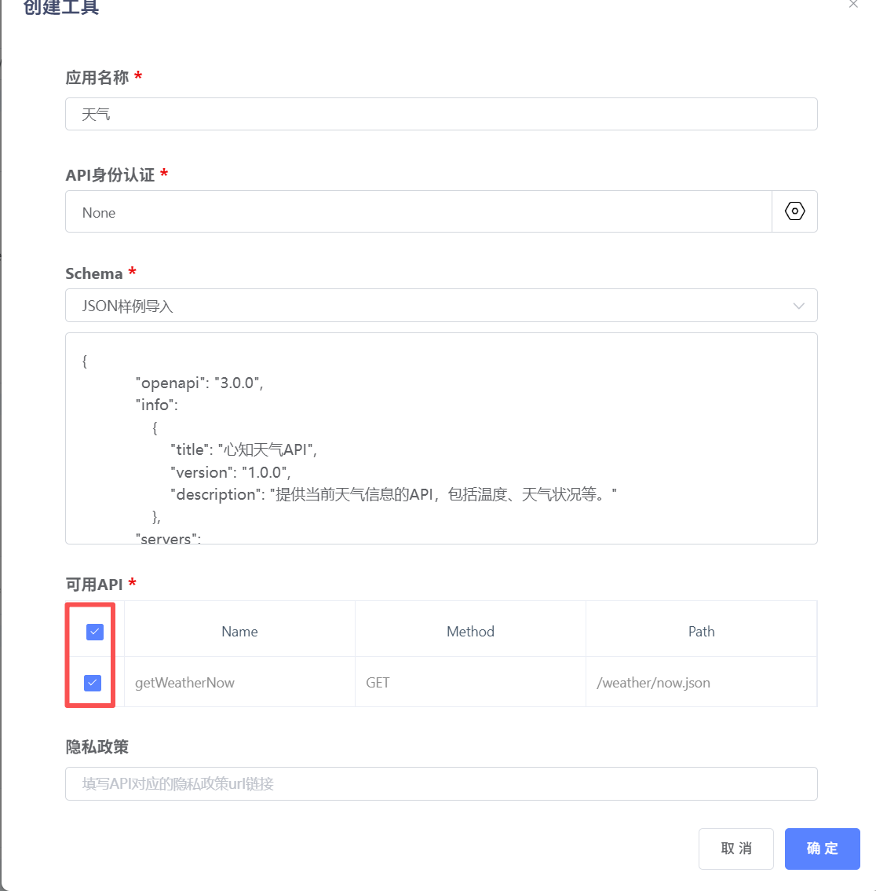
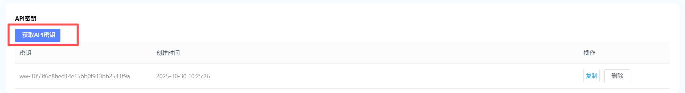

# MCP服务

#### 【导入MCP】

点击“导入”，关联自己的MCP，可支持在工作流中使用。用户需填写服务名称、服务来源、功能描述、MCP ServerURL。点击“获取MCP工具”，获取成功后，将显示可用接口。点击“确认发布”，即可在平台上查看每个工具的详细内容。

#### 【创建MCP】

平台支持用户绑定工具，创建自己的MCP Server，并对外提供服务。这里可以看到你创建的所有 MCP server，以及他们管理的工具数量。

**1、创建MCP**

点击**”创建MCP“**，即可进入创建页面，用户可配置MCP Server的图标，名称、描述。

**2、查看服务地址**

点击“确定”，可进入编辑界面。平台提供SSE URL和Streamable HTTP两类服务地址，及对应的请求示例。

**3、绑定应用**

**3.1 关联已有应用**

点击**“关联”**，可绑定用户自定义工具。自定义工具可在【资源库】-【工具】-【自定义】模块进行添加。选择需要的工具，点击**“添加”**。

添加后，用户可编辑工具对外输出的显示名称（仅限英文）和描述。

**3.2 创建应用**

点击**“创建”**，可新建工具。输入名称、选择API鉴权方式、填写Schema，可自动解析出可用API。用户可根据需要，勾选想要绑定的API。点击**“确定”**，即可保存。添加后，用户可编辑工具对外输出的显示名称（仅限英文）和描述。

**4、API密钥**

点击“获取API密钥”，可生成密钥。请您妥善保管密钥。

