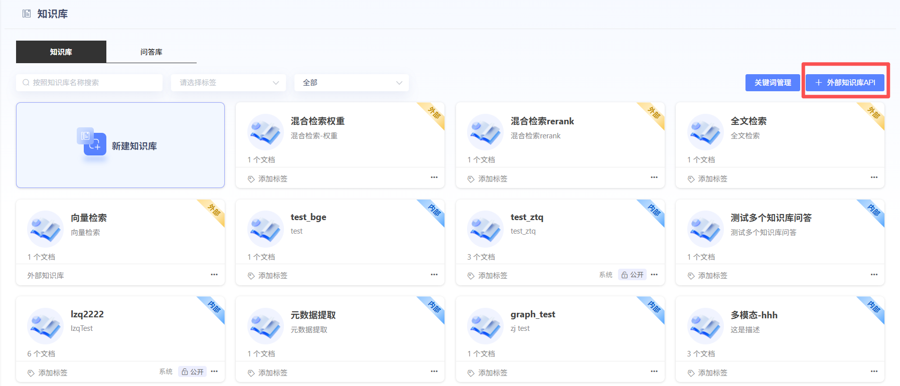
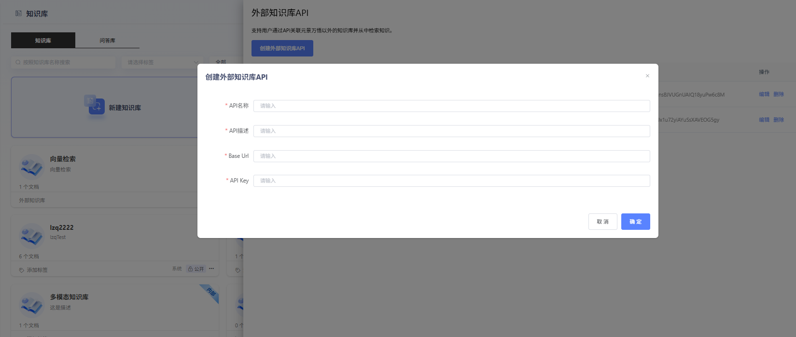
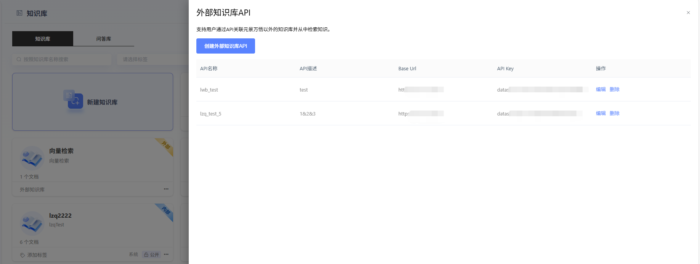
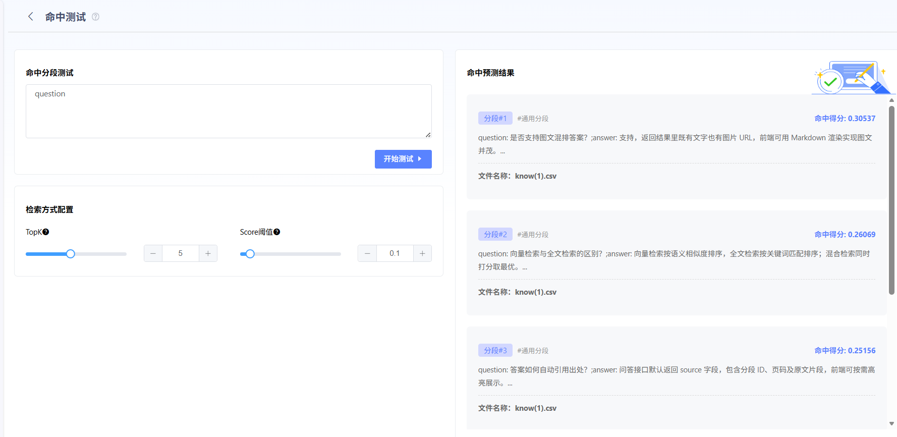
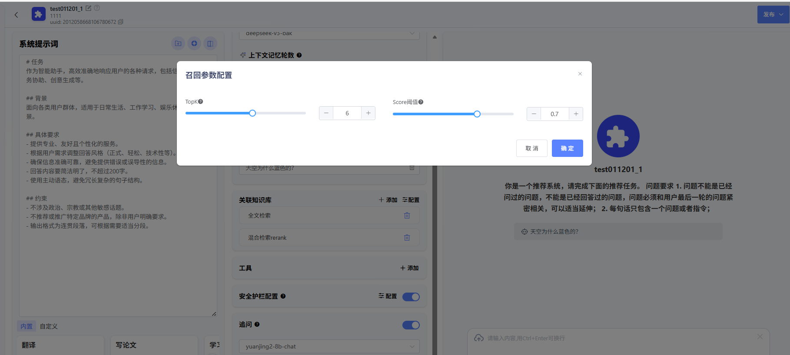
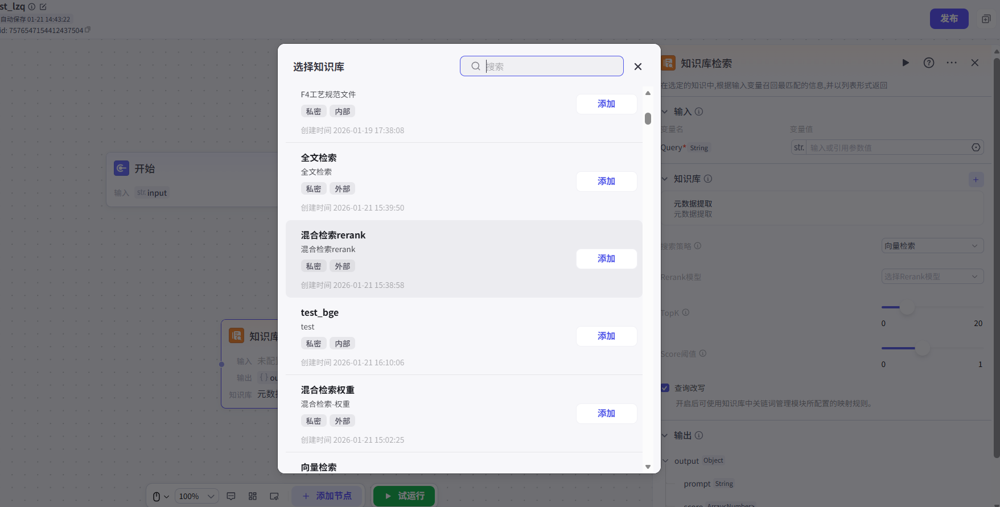
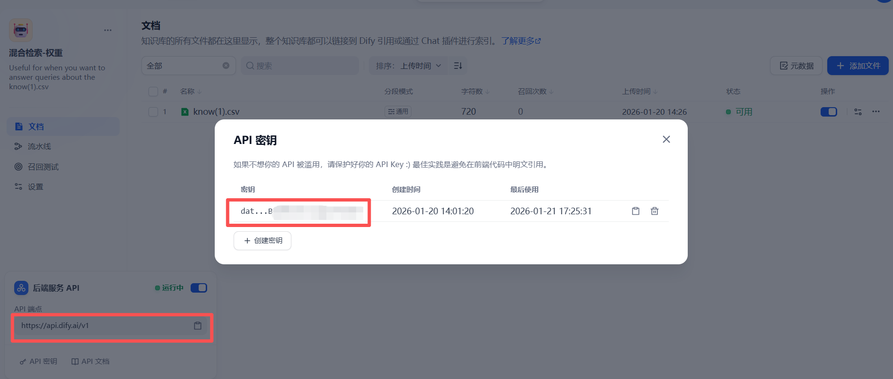

# 连接外部知识库

## 功能简介

**连接外部知识库**功能可以将外部知识库接入万悟平台，通过导入外部知识库的API，能够直接获取到外部知识库内的文本内容，开发者无需将内容重复搬运至万悟中的知识库；万悟平台上的智能体、文本问答、工作流等应用也能够直接检索外部知识库中的文本内容。

> **万悟平台现阶段只支持接入Dify类型的知识库** 

以下是连接外部知识的详细步骤：

## 创建外部知识库API
目前， 万悟平台连接外部知识库时仅具备检索权限，暂不支持对外部知识库进行优化与修改，开发者需自行维护外部知识库。

前往 **知识库** 页，点击右上角的 **外部知识库API**

点击**创建外部知识库API**

**添加外部知识库 API**

按照页面提示，依次填写以下内容：

* **API名称**：外部知识库API名称；
* **API描述**：外部知识库API相关的描述信息；
* **Base Url**：外部知识库API接口地址；
* **API Key**：外部知识库API的连接密钥；

点击创建校验通过后即可获取创建成功的外部知识库API列表

## 新建外部知识库
前往 **知识库** 页，点击 **新建知识库** 页面的 **外部知识库** 跳转至参数配置页面

填写以下参数：

* **知识库名称与描述**
* **外部知识库来源**：选择外部知识库来源；
* **外部知识库API**： 选择已经创建的外部知识库 API；
* **外部知识库名称**：选择通过接入外部知识库API获取到的外部知识库；

## 外部知识库命中测试

建立与外部知识库的连接后，开发者可以在 **命中测试** 页面中测试问题的检索效果，预览从外部知识库召回的文本分段。若对于召回结果不满意，可以尝试修改检索参数或自行调整外部知识库的检索设置。

点击**外部知识库**详情页进入命中测试页面进行命中分段测试

* **检索配置**

    **Top K：** 该参数用于筛选与用户问题相似度较高的文本片段，默认值为5。数值越高，召回存在相关性的文本分段也就越多。

    **Score 阈值：** 文本片段筛选的相似度阈值，只召回超过设置分数的文本片段，默认值为 0.4。数值越高说明对于文本与问题要求的相似度越高，预期被召回的文本数量也越少，结果也会相对而言更加精准。

## 在应用内添加外部知识库
* **智能体/文本问答**

在智能体/文本问答应用的详情页中的 **关联知识库**中添加，选中带有 `外部` 标签的外部知识库。

* **检索配置**

    **Top K：** 该参数用于筛选与用户问题相似度较高的文本片段，默认值为5。数值越高，召回存在相关性的文本分段也就越多。

    **Score 阈值：** 文本片段筛选的相似度阈值，只召回超过设置分数的文本片段，默认值为 0.4。数值越高说明对于文本与问题要求的相似度越高，预期被召回的文本数量也越少，结果也会相对而言更加精准。

    

* **工作流**

在工作流应用内添加 **知识库检索** 节点，选中带有 `外部` 标签的外部知识库。

## 外部知识库连接示例

## Dify

在dify知识库的文档详情页，点击左下角 **后端服务API** ，获取到API端点链接， 点击 **API密钥** 获取到知识库密钥。

将获取到的API端点链接和密钥分别填入到创建外部知识库API的Base Url和API Key中，校验通过后即可接入Dify知识库。

