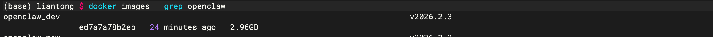
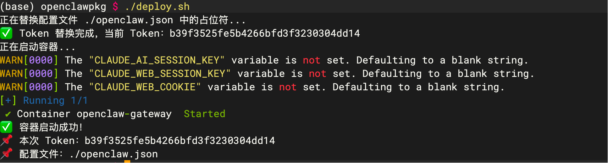
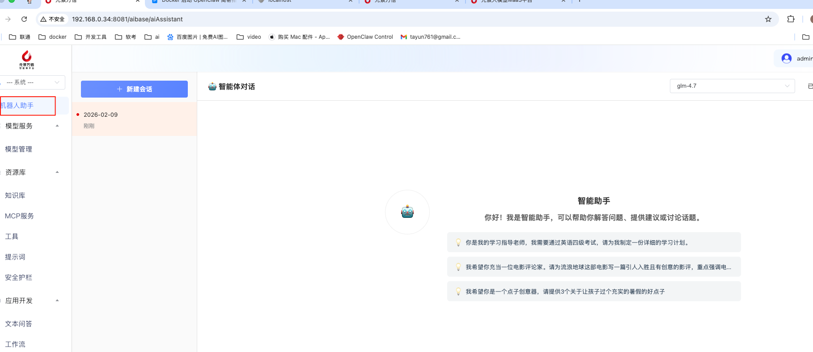

# Docker 启动 OpenClaw 简易指南

## 一、前置准备

1、已安装 Docker（20.10.0+）

2、本地有 OpenClaw 镜像文件及相关部署文件

文件下载地址：https://pan.baidu.com/e/1cupIcEP2RBwi_hOr4xQnFQ?pwd=ae86

## 二、load image

### 文件清单

镜像：`openclaw_arm64_v2026.2.3.tar.gz`或`openclaw_amd64_v2026.2.3.tar.gz`（根据架构选择对应镜像）

部署：`openclawpkg.zip` 

### 解压(amd64架构为例)

```shell
tar -zxvf openclaw_amd64_v2026.2.3.tar.gz
uzip openclawpkg.zip
```

### load image

```shell
docker load -i openclaw_amd64_v2026.2.3.tar
```



## 三、启动服务

### 1、执行启动脚本 

```shell
$cd openclawpkg
$./deploy.sh
```



### 2、界面刷新

右上角选择可用的模型即可



## 四、常用操作

*   重启服务：./deploy.sh  (重置token，恢复出厂设置)
    
*   停止容器：`docker compose stop`
    
*   重启容器：`docker compose restart` 
    
*   查看日志：`docker logs -f openclaw-gateway`
    
*   删除容器：`docker rm -f openclaw-gateway`