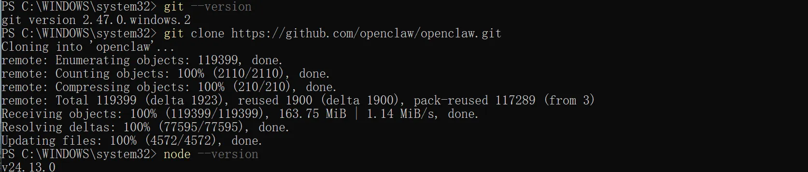
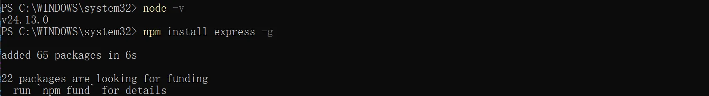
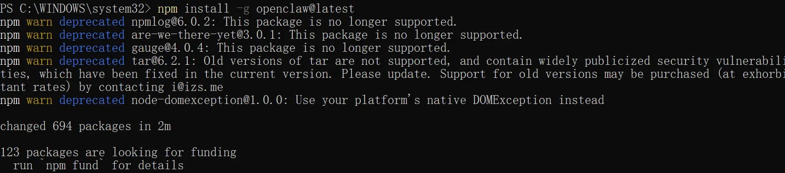
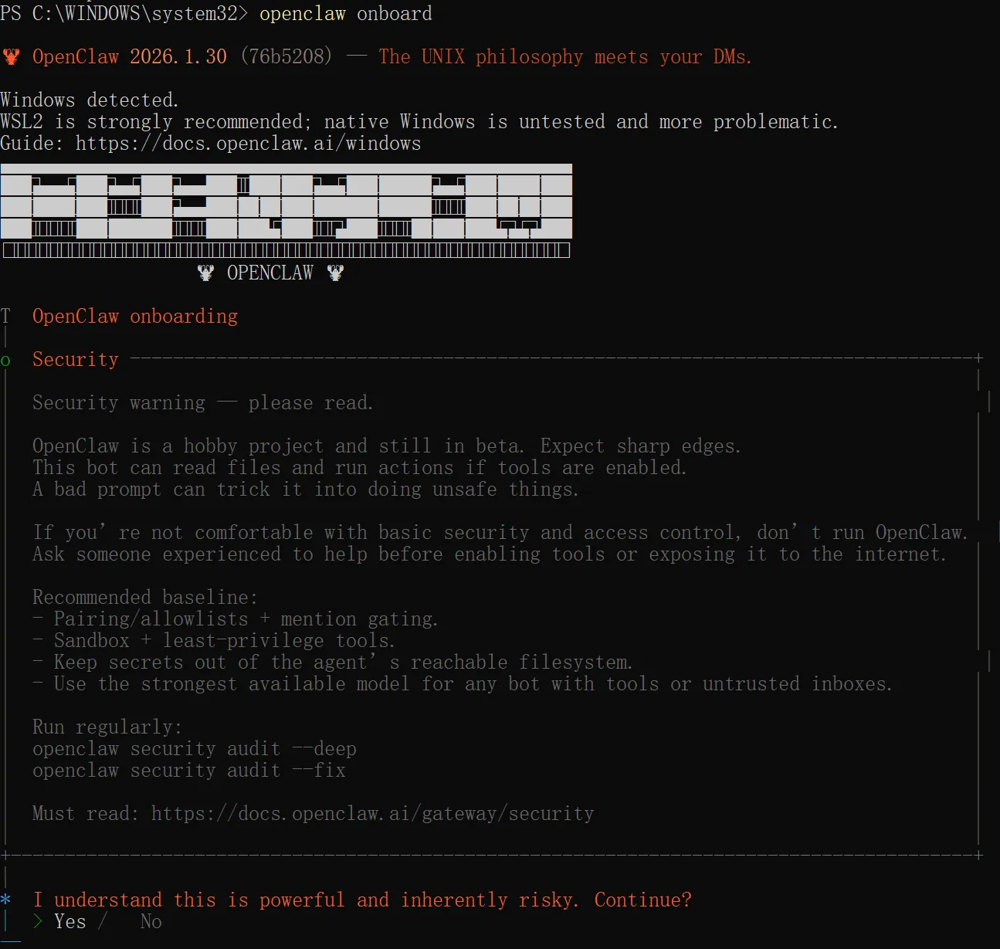
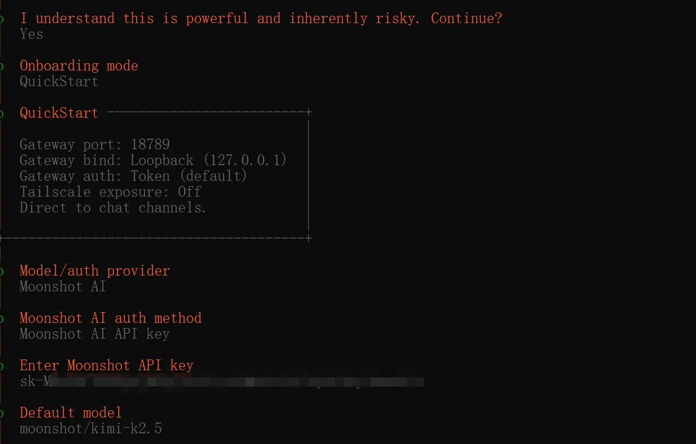
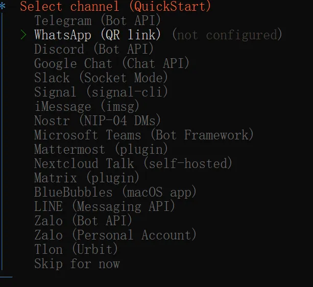
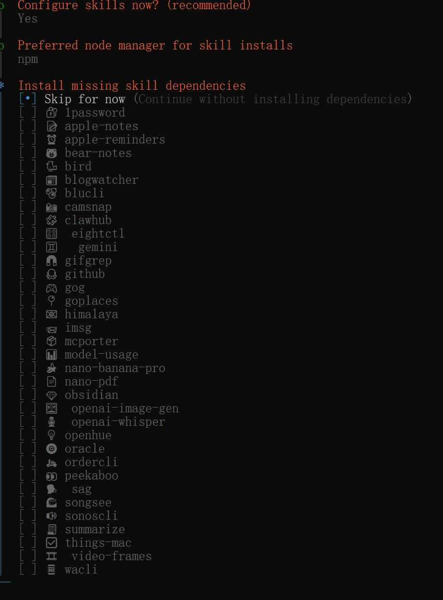
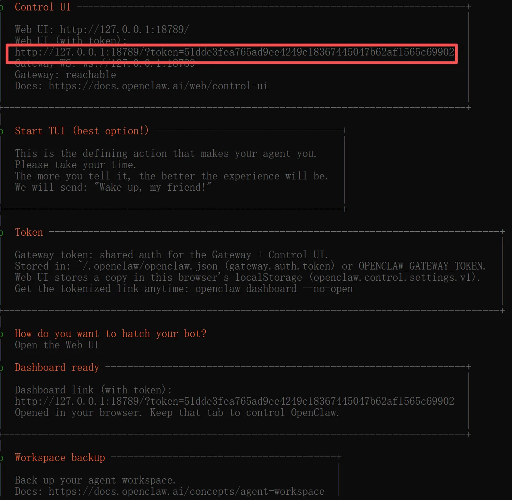
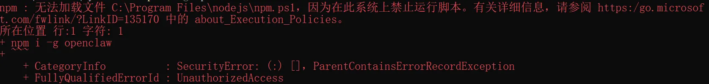
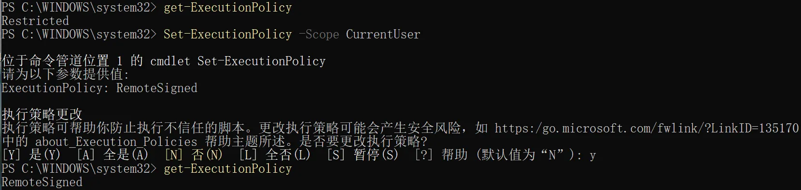

# OpenClaw部署文档Windows版

## 快速安装

> 以管理员模式打开终端，确保能访问git和node依赖

### Windows PowerShell

```plaintext
iwr -useb https://openclaw.ai/install.ps1 | iex
```

### CMD

```plaintext
curl -fsSL https://openclaw.ai/install.cmd -o install.cmd && install.cmd && del install.cmd
```

## npm安装

### 第一步：安装依赖

以管理员模式打开 Power Shell终端，确保 Git 和 node已经安装并能成功下载到代码和依赖。





### 第二步：安装openclaw

```plaintext
npm install -g openclaw@latest
```



## 配置openclaw

输入下述命令配置openclaw

```plaintext
openclaw onboard
```



配置大模型



配置要接入的channel



选择要配置的skills



安装成功后 在 Windows 浏览器中访问：[http://127.0.0.1:18789](http://127.0.0.1:18789)即可进入openclaw界面



## 常见问题排查

### Q1: 报错 npm : 无法加载文件 C:\Program Files\nodejs\npm.ps1，因为在此系统上禁止运行脚本



**原因**：执行策略/权限受限

**解决**：终端输入 `Set-ExecutionPolicy -Scope CurrentUser` 输入`RemoteSigned`命令给用户赋予权限

