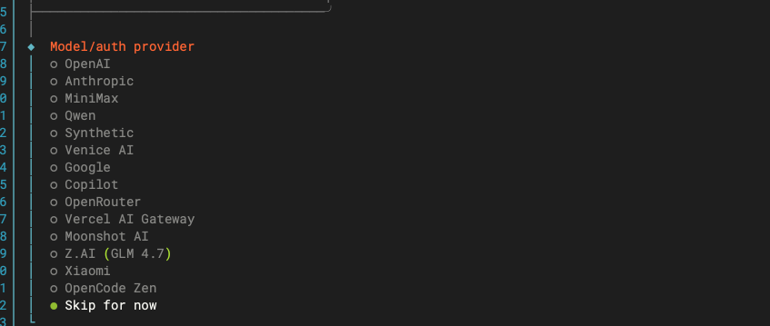
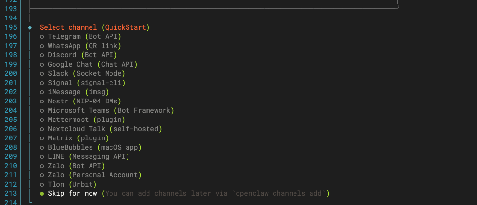
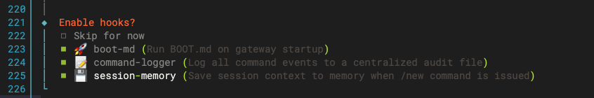
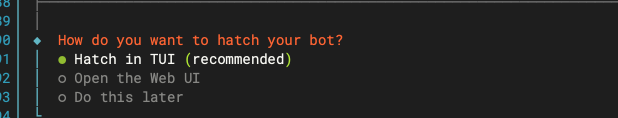
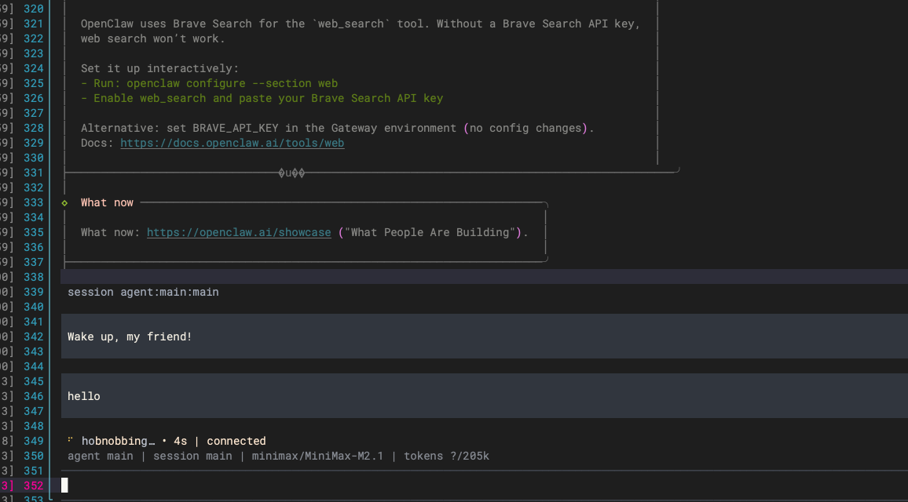
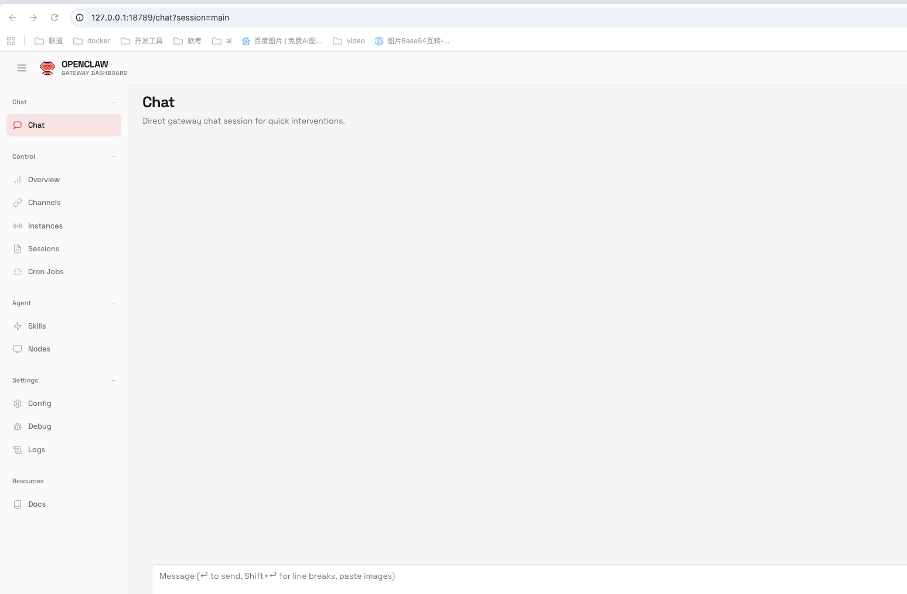
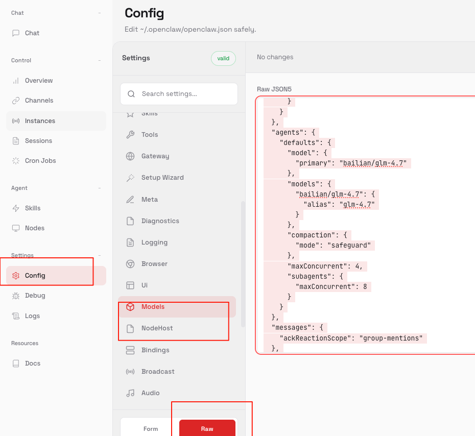

# OpenClaw部署文档Mac版

## 一、部署准备

### 官网地址

[https://openclaw.ai/](https://openclaw.ai/)

### 本地部署命令

```bash
curl -fsSL https://openclaw.ai/install.sh | bash
```
---

## 二、安装步骤

### 安装界面选项

1.  **安全提示**
    
    
    
    *   提示安装有风险，选择 yes
    
2.  **安装格式**
    
    
    
    *   选择 `QuickStart`
    
3.  **模型供应商**
    
    
    
    *   选择 `Skip for now`（先跳过，后续单独配置）
        
    *   后续如有再次提示，随意选择一个即可（不影响使用）
    
4.  **关联聊天应用**
    
    
    
    *   此步骤用于关联类似微信的聊天软件
        
    *   由于主要是国外应用，选择跳过即可
    
5.  **安装 Skills**
    
    
    
    *   选择跳过（后续可在网页端自定义配置）
    
6.  **错误处理 Hook 配置**
    
    
    
    *   用于命令行出现异常时的诊断和处理
        
    *   建议全部勾选，方便后续问题定位和排查
    
7.  **二次安装**
    
    
    
    *   按回车确认后，会进行二次安装流程
    
8.  **启动界面**
    



---

## 三、验证部署

安装完成后：

*   终端会显示对话界面
    
*   浏览器会自动弹出前端页面：[http://127.0.0.1:18789/chat?session=main](http://127.0.0.1:18789/chat?session=main)
    



此时 OpenClaw 基础部署已完成。

---

## 四、模型配置

### 配置入口

访问网页端，选择 `config -> raw`



### 配置模型

找到 `model` 和 `agent` 相关配置，参考以下内容进行替换。

#### 示例：配置元景 MAAS 的 GLM-4.7 模型

```json
{
  "models": {
    "mode": "merge",
    "providers": {
      "yuanjing": {
        "baseUrl": "https://maas-api.ai-yuanjing.com/openapi/compatible-mode/v1",
        "apiKey": "",
        "api": "openai-completions",
        "models": [
          {
            "id": "glm-4.7",
            "name": "glm-4.7",
            "reasoning": false,
            "input": ["text"],
            "cost": {
              "input": 0.0025,
              "output": 0.01,
              "cacheRead": 0,
              "cacheWrite": 0
            },
            "contextWindow": 262144,
            "maxTokens": 105536
          }
        ]
      }
    }
  },
  "agents": {
    "defaults": {
      "model": {
        "primary": "yuanjing/glm-4.7"
      },
      "models": {
        "yuanjing/glm-4.7": {
          "alias": "glm-4.7"
        }
      },
      "compaction": {
        "mode": "safeguard"
      },
      "maxConcurrent": 4,
      "subagents": {
        "maxConcurrent": 8
      }
    }
  }
}
```

**注意**：请将 `apiKey` 替换为实际的 API 密钥。

---

## 五、常用命令速查

### 一、日常运维（基础状态/日志/健康检查）

```bash
openclaw status                          # 检查核心服务状态（网关/渠道/模型）
openclaw status --all                    # 完整诊断（所有模块状态+配置+依赖）
openclaw health                          # 健康检查（网关端口/模型连通性/渠道在线状态）
openclaw logs --follow                   # 实时查看全局日志（跟踪运行状态）
openclaw logs --follow --module gateway  # 仅实时查看网关日志（排查启动失败）
```
---

### 二、配置管理（交互配置/查看/修改）

```bash
openclaw configure                       # 交互式配置（终端向导修改核心配置）
openclaw config get                      # 查看全部配置（JSON格式）
openclaw config get gateway.port         # 查看指定配置项（示例：网关端口）
openclaw config set <key> <value>        # 临时设置配置（仅当前会话生效）
openclaw config set --persist <key> <value>  # 永久设置配置（写入文件，重启生效）
openclaw config reset                    # 重置所有配置（恢复默认，谨慎使用）
openclaw config reset models             # 仅重置模型配置（示例：重置模型相关）
```
---

### 三、Gateway（核心网关服务）

```bash
openclaw gateway start                   # 启动网关（后台运行）
openclaw gateway start --foreground      # 前台启动网关（看实时日志，排查问题）
openclaw gateway start --port 18790      # 指定端口启动网关（覆盖配置文件）
openclaw gateway stop                    # 停止网关
openclaw gateway restart                 # 重启网关（修改配置后必执行）
openclaw gateway status                  # 查看网关详细状态（端口/绑定地址/日志路径）
openclaw gateway logs --follow           # 实时查看网关专属日志
```
---

### 四、渠道管理（登录/状态/启停）

```bash
openclaw channels login whatsapp         # WhatsApp 登录（扫描终端二维码配对）
openclaw channels login telegram --token <BotToken>  # Telegram 登录（输入Bot Token）
openclaw channels status                 # 查看所有渠道状态（在线/离线/配对信息）
openclaw channels status whatsapp        # 查看指定渠道状态（示例：WhatsApp）
openclaw channels start all              # 启动所有渠道
openclaw channels start telegram         # 启动指定渠道（示例：Telegram）
openclaw channels stop all               # 停止所有渠道
openclaw channels stop whatsapp          # 停止指定渠道（示例：WhatsApp）
openclaw channels restart all            # 重启所有渠道
```
---

### 五、配对管理（待处理配对/批准）

```bash
openclaw pairing list                    # 查看待处理的配对请求（多设备/多渠道）
openclaw pairing approve <channel> <code>  # 批准配对（示例：openclaw pairing approve whatsapp 123456）
openclaw pairing reject <channel> <code>   # 拒绝配对（示例：openclaw pairing reject telegram 654321）
```
---

### 六、模型管理（列表/切换/测试）

```bash
openclaw models list                     # 列出所有已配置的模型（含提供商/状态）
openclaw models set <provider/model>     # 切换默认模型（示例：openclaw models set bailian/glm-4.7）
openclaw models test <provider/model>    # 测试模型连通性（示例：openclaw models test bailian/glm-4.7）
```
---

### 七、故障排除（诊断/修复/兜底）

```bash
openclaw doctor                          # 全量诊断（依赖/配置/端口/权限）
openclaw doctor --fix                    # 自动修复可解决的问题（如依赖缺失/配置语法错误）
openclaw doctor --module gateway         # 仅诊断网关模块（示例：排查网关启动失败）
openclaw version                        # 查看OpenClaw版本（确认是否兼容配置）
openclaw update                          # 升级OpenClaw到最新版本（替代npm update -g openclaw）
```
---