# OpenClaw对接钉钉

# 一、前置准备

1.  已安装wsl2环境
    
2.  已安装ubuntu20.04（其他版本也可以）
    
3.  已安装openclaw并配置了模型
    

# 二、安装钉钉插件

openclaw 安装钉钉插件

```shell
openclaw plugins install https://github.com/soimy/clawdbot-channel-dingtalk.git
```

# 三、创建钉钉应用

登录[钉钉开放平台](https://link.zhihu.com/?target=https%3A//open-dev.dingtalk.com/)，点击「创建应用」

注意：创建钉钉应用需要你的钉钉账号有开发者权限。如果没有，可以联系组织管理员获取，或参考[获取开发者权限](https://link.zhihu.com/?target=https%3A//open.dingtalk.com/document/orgapp/obtain-developer-permissions)

这里不方便找管理员要权限，可以先进入 **3.1创建企业** 。如果可以找管理员要权限，可以直接进入 **3.2创建应用** 步骤

## 3.1 创建企业

打开钉钉客户端，左上角创建企业

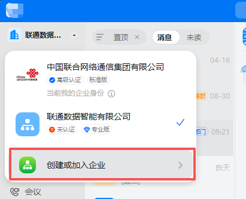

填入创建企业信息

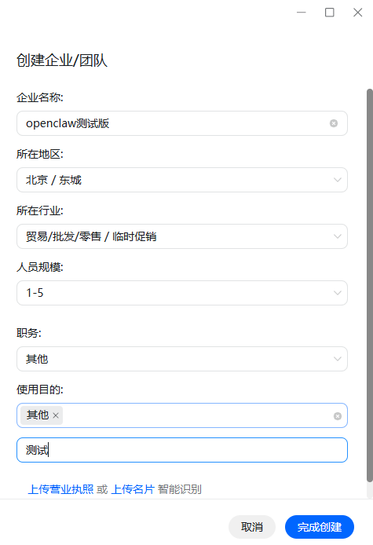

登录[钉钉开放平台](https://link.zhihu.com/?target=https%3A//open-dev.dingtalk.com/)，选择刚才创建的企业

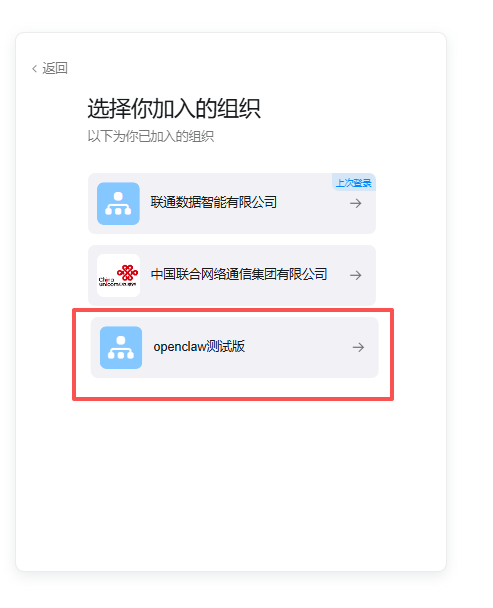

## 3.2 创建应用

在应用开发的左侧导航栏中，点击「钉钉应用」，然后点击右上角「创建应用」。

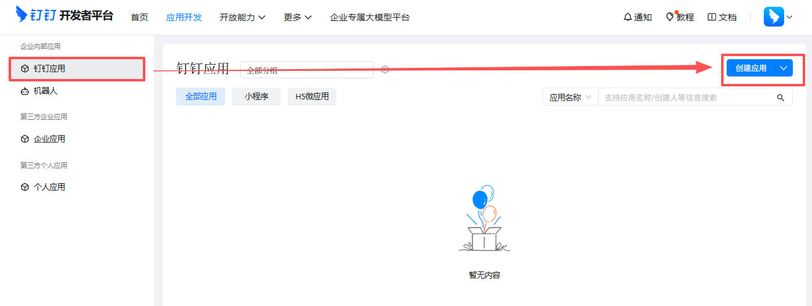

填写应用名称和应用描述，上传应用图标后保存。

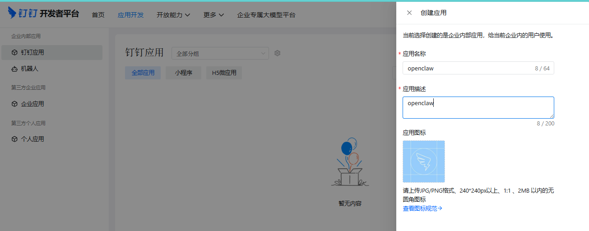

添加机器人

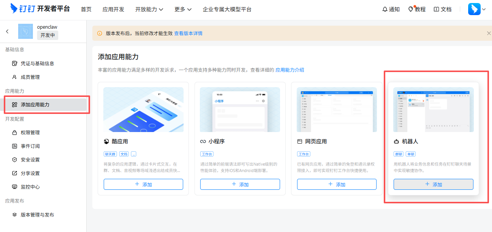

然后配置基本信息

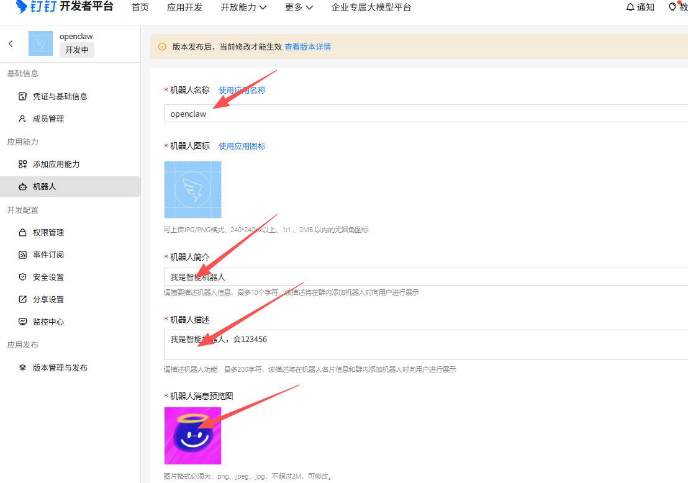

配置完以后还得发布

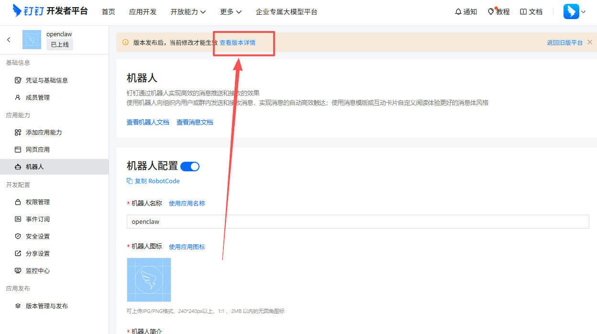

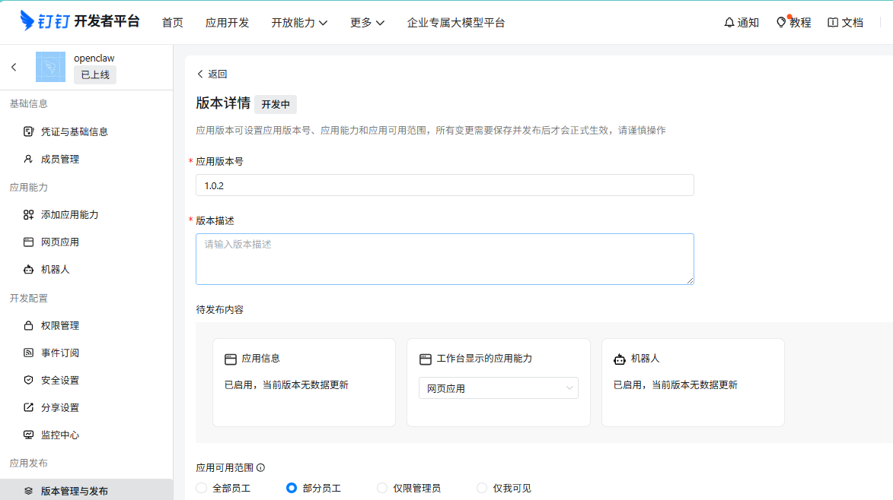

## 获取凭证信息

发布版本成功之后，点击左侧菜单的「凭证与基础信息」，获取以下凭证信息

*   Agent ID (应用 ID)
    
*   Client ID (AppKey)
    
*   Client Secret (AppSecret)
    
*   Robot Code (与 Client ID 相同)
    
*   CorpId
    

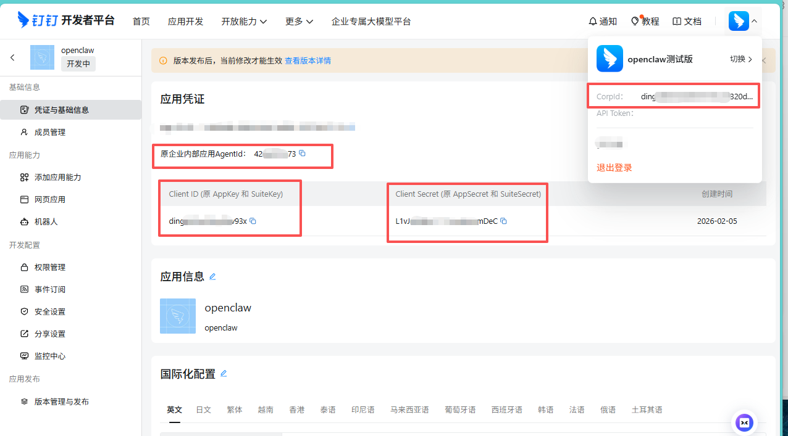

## 添加钉钉配置

找到 `openclaw.json` 配置文件。使用下面的命令找到配置文件

```shell
find / | grep openclaw.json
```

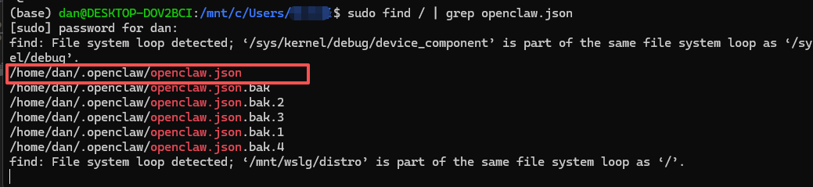

vim /home/dan/.openclaw/openclaw.json

在 channels 添加 dingtalk 相关数据

```shell
{
  "channels": {
    "dingtalk": {
      "enabled": true,
      "clientId": "dingxxxxxx",
      "clientSecret": "your-app-secret",
      "robotCode": "dingxxxxxx",
      "corpId": "dingxxxxxx",
      "agentId": "123456789",
      "dmPolicy": "open",
      "groupPolicy": "open",      
      "messageType": "markdown",       
      "debug": false
    }
  }
}
```

示例：

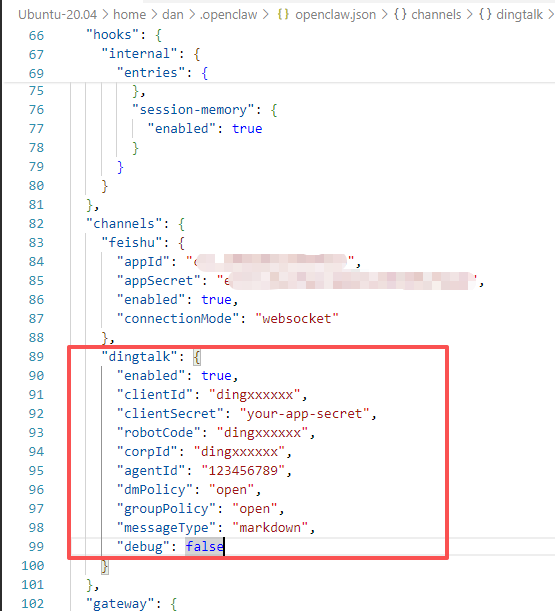

## 钉钉机器人使用

配置完成以后，直接保存文件即可，然后进入钉钉客户端，搜索拦搜应用的名称。

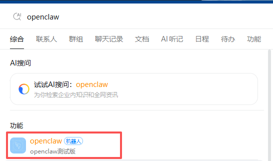

经过测试，可以开始使用了。

