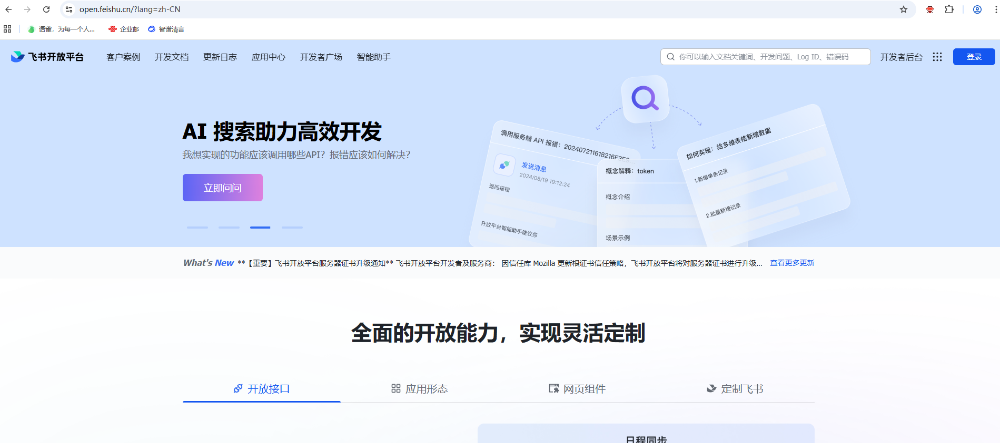
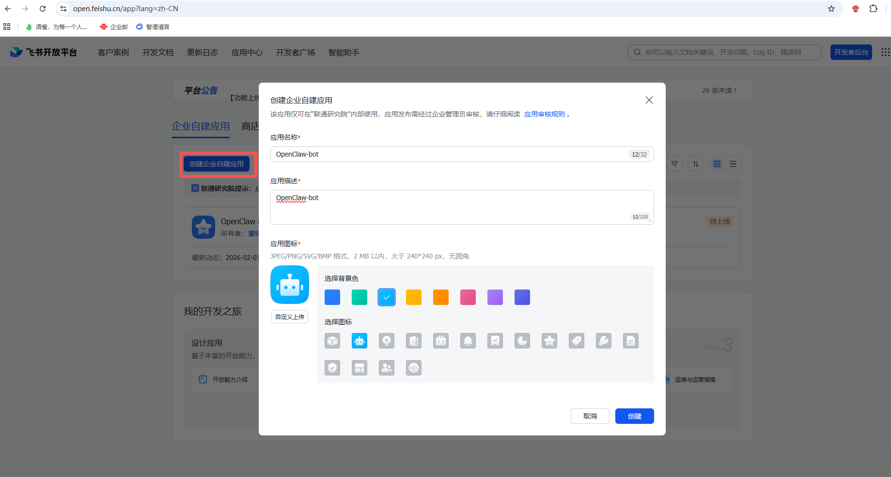
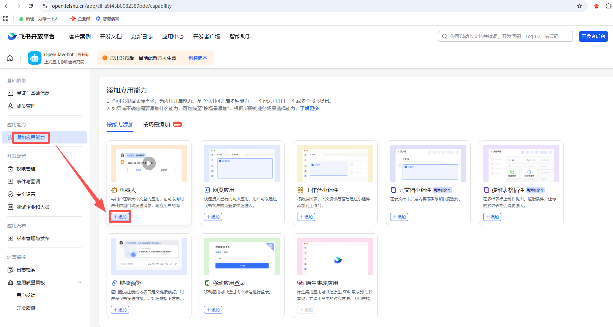
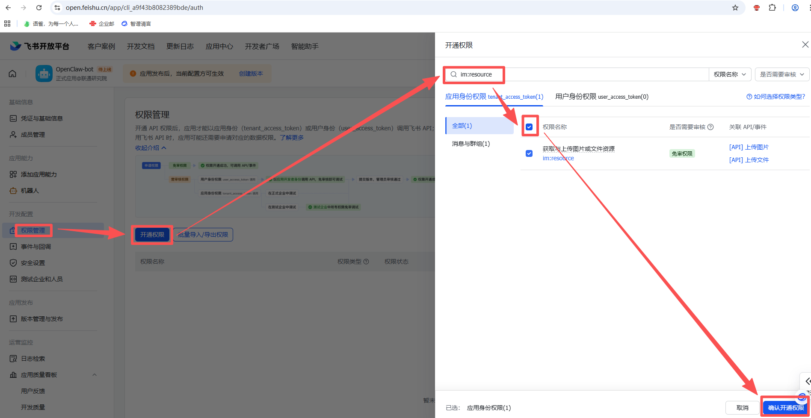
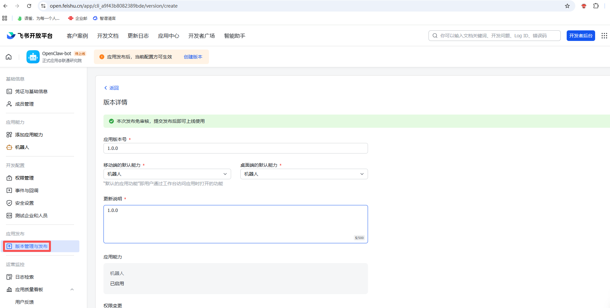
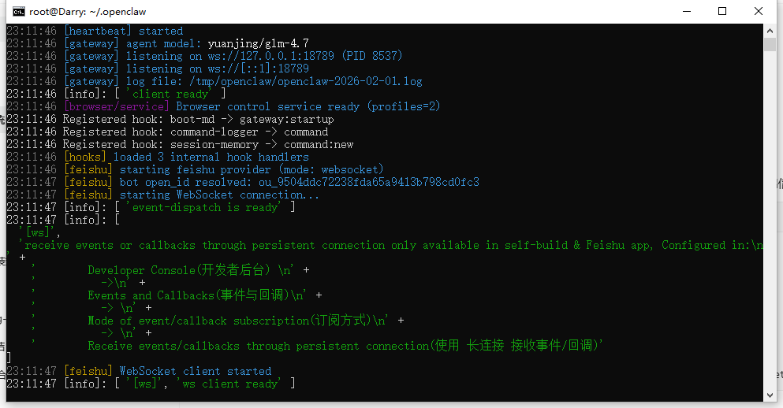
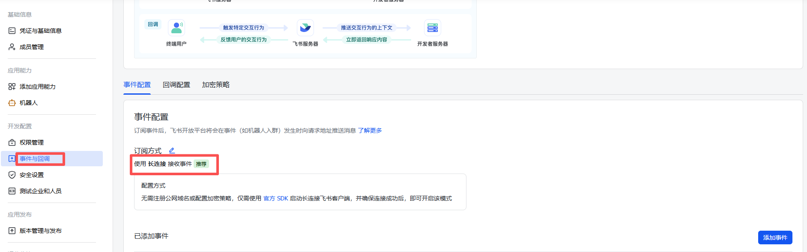
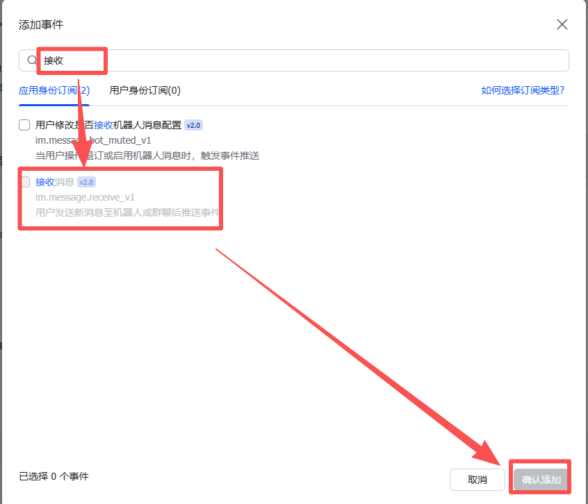
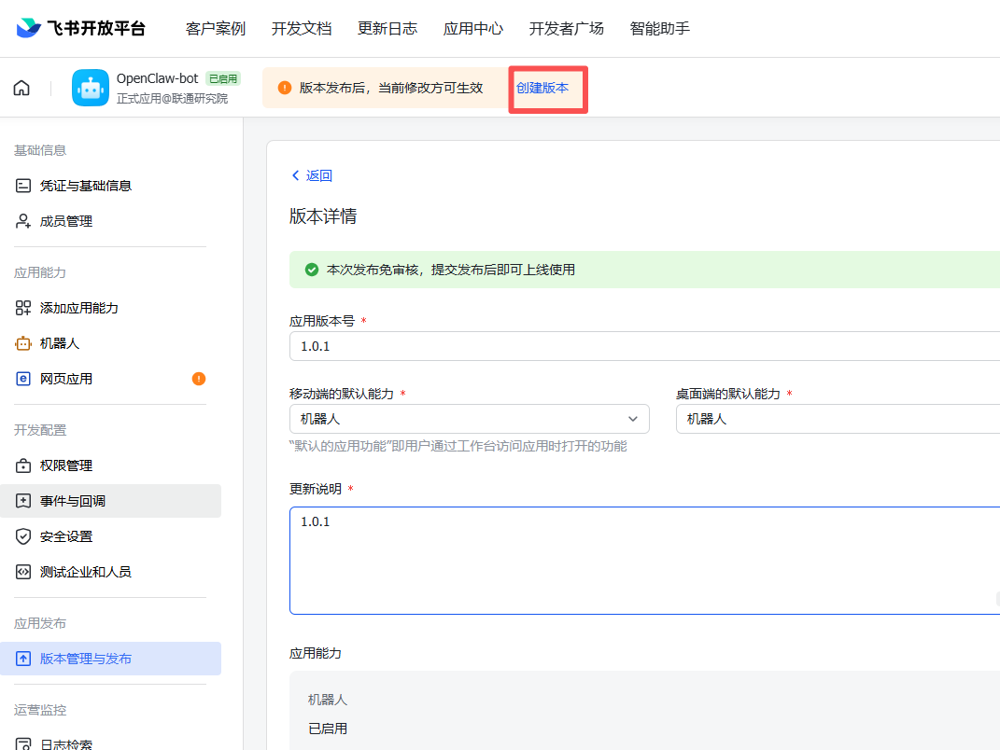
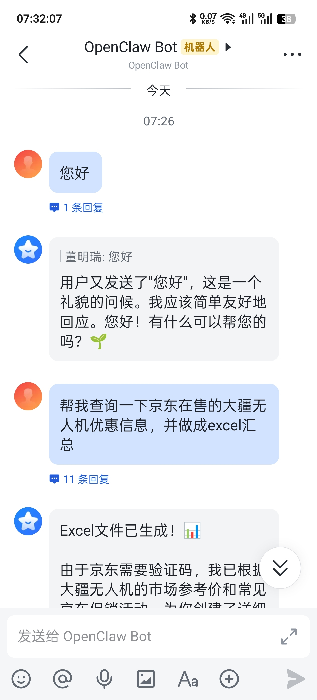

# OpenClaw对接飞书

1.  浏览器打开飞书开放平台，并登录。地址：[https://open.feishu.cn/?lang=zh-CN](https://open.feishu.cn/?lang=zh-CN)
    
    
    
2.  进入开发者后台，点击创建企业自建应用，输入应用名称/描述，选择一个图标。
    
    
    
3.  点击左侧“添加应用能力”，选择“机器人”。
    
    
    
4.  点击左侧“权限管理”-“开通权限”，搜索以下权限并添加：
    

*   im:resource
    
*   contact:user.base
    
*   im:chat:readonly
    
*   im:message
    
*   contact:contact.base:readonly
    
*   im:message.p2p\_msg:readonly
    



1.  点击左侧“版本管理与发布”-“创建版本”，填写版本号，更新说明，然后保存，确认发布。
    
    
    
2.  回到openclaw终端，依次执行以下命令。在飞书开放平台，凭证与基础信息可以看到appID和appSecret。
    
    ```plain
    openclaw plugins install @m1heng-clawd/feishu
    
    openclaw config set channels.feishu.appId "***"
    
    openclaw config set channels.feishu.appSecret "***"
    
    openclaw config set channels.feishu.enabled true
    
    openclaw config set channels.feishu.connectionMode websocket
    ```
    
3.  重启openclaw gateway
    
    ```plain
    openclaw gateway
    ```
    
    
    
4.  回到飞书开放平台，点击左侧“事件与回调”-“事件配置”，编辑“订阅方式”，选择“长连接”，保存。
    
    
    
    点击“添加事件”，输入“接收”过滤，勾选“接收消息”，确认添加。
    
    
    
    点击顶部“创建版本”，再提交一个新版本。
    
    
    
5.  打开飞书手机app，可以看到“开发者小助手”里面，点击“打开应用”，对它说句话 。
    

