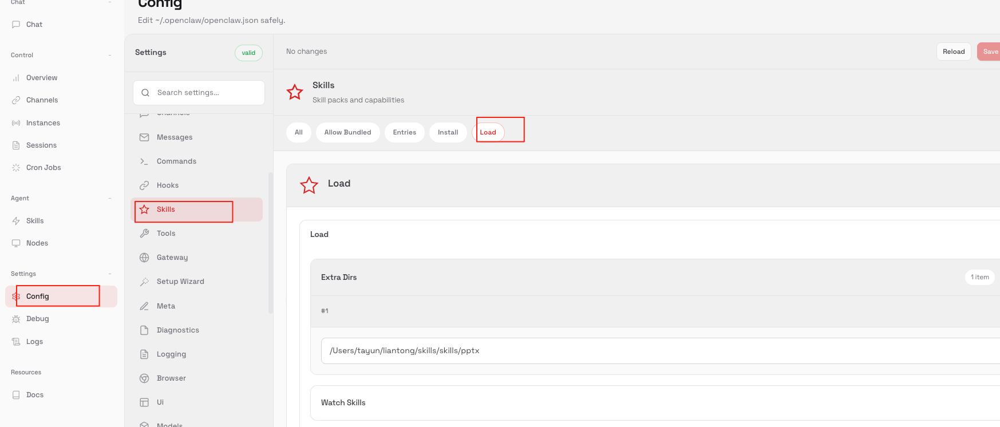
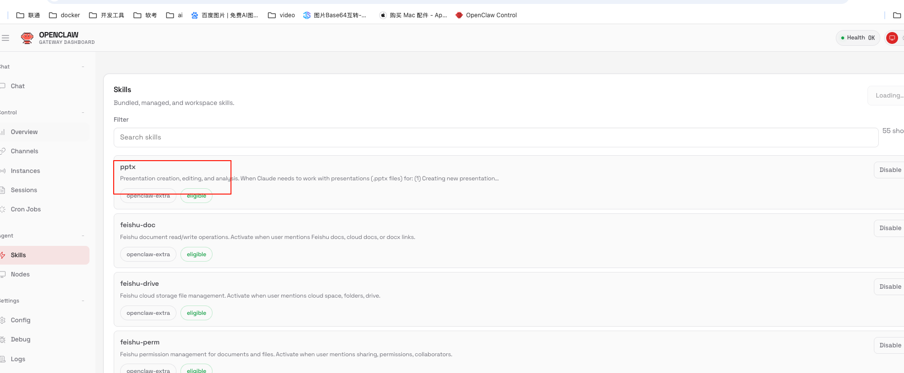
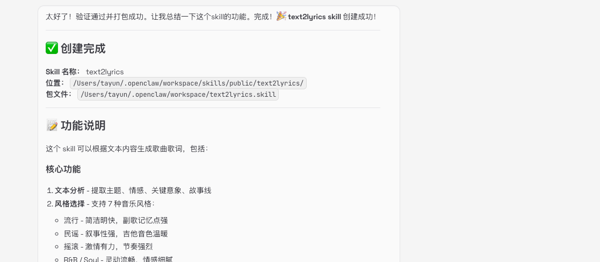
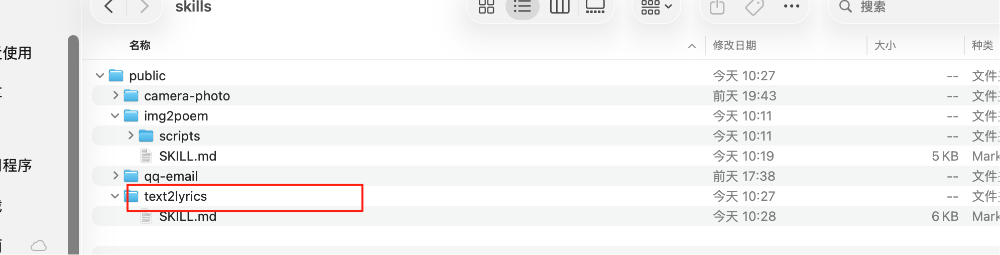
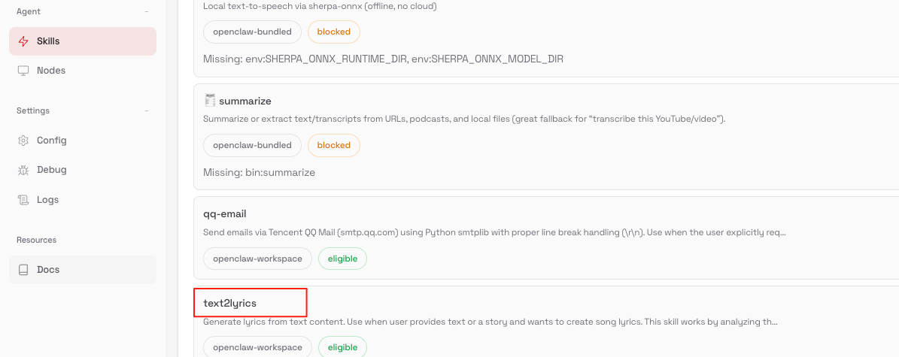
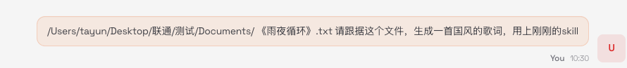

# OpenClaw 接入 Skill 教程

OpenClaw 接入 Skill 主要有两种方式：**手动导入指定 Skill**、**创建自定义 Skill**，以下是详细操作步骤。

## 一、手动导入 Skill

### 前提准备

提前准备好需要导入的 Skill 文件夹，可从以下推荐网址获取 Skill 资源：

*   [Anthropics Skills 仓库](https://github.com/anthropics/skills)
    
*   [MCPMarket Skills 平台](https://mcpmarket.cn/skills/)
    

### 操作步骤

1.  打开 OpenClaw 界面 UI，进入 `config` → `Skills` 页面；
    
2.  选择 `load` 标签，点击 `Add` 按钮；
    
3.  在下方空白处填写本地 Skill 包的路径，建议开启 `watch skills` 选项，最后点击 `save` 保存；
    

> 示例：导入本地 pptx 技能包（配图） 

### 备选方式（Raw 模式/配置文件修改）

也可选择 raw 模式，或直接修改本地 `openclaw.json` 配置文件，添加如下配置：

```json
"skills": {
  "allowBundled": [
    ""
  ],
  "load": {
    "extraDirs": [
      "本地skill路径" // 替换为实际的Skill文件夹路径
    ],
    "watch": true
  }
}

```

### 验证结果

保存后，即可在 OpenClaw 的 `skills` 菜单中找到刚导入的 Skill。

> 

## 二、创建自定义 Skill（推荐）

该方式适合构建个性化专属 Skill，只需向 OpenClaw 描述需求，即可自动生成对应的 Skill 包，操作简单高效。

### 操作示例：创建“根据图片生成古诗”的 Skill

1.  **提出需求**：向 OpenClaw 明确说明“创建一个可根据图片文件生成古诗的 Skill”；
    
    > 
    
2.  **等待生成**：Skill 包及对应程序的生成需要一定时间，请耐心等待；
    
    > 
    
3.  **验证生成结果**：生成完成后，界面会显示新 Skill 的文件路径，可检查文件是否已成功生成；
    
    > 
    
4.  **查看 Skills 模块**：在 OpenClaw 的 `skills` 模块中可确认新 Skill 已添加；
    
    > 
    
5. **验证 Skill 效果**：使用该 Skill 测试“根据图片生成古诗”的功能是否正常；

> 